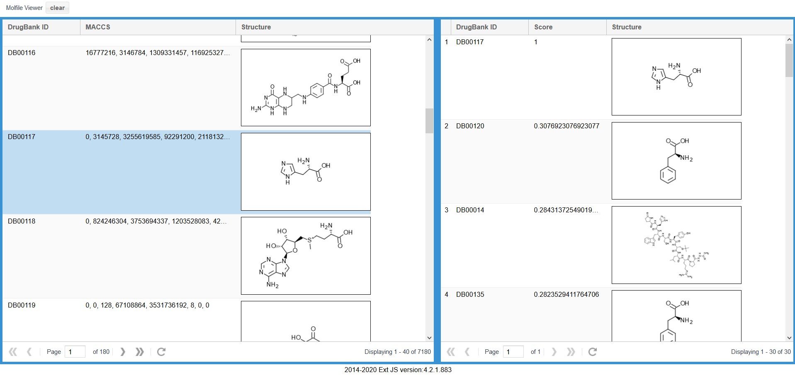

# Molfile Viewer

Simple molfile viewer with sorting feature by Tanimoto coefficient.

## Requirements

- Django-3.0 or later
- Ext.js
- ChemDoodle Web Component



## Install

project/settings.py

```
INSTALLED_APPS = [
    'molfile.apps.MolfileConfig',
```

project/urls.py
```
from django.urls import include, path

urlpatterns = [
    path('molfile/', include('molfile.urls')),
```

```
mkdir data
cp drugbank.sdf data/
python manage.py migrate
```
